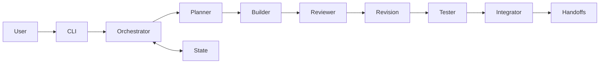

# MASERS

Multi-AI Software Engineering & Review System。AI 不共享聊天，而是共享狀態、交接、決策與版本化成果。

## 目前版本

Phase 1：可執行的單機 Mock pipeline。此版本驗證協作協定，不會建立 Todo 程式，也不會將模擬 Review 或 Test 當成真正通過驗收。`completed` 表示模擬流程完成。



## 安裝與環境

Python 3.11+；核心無第三方執行相依套件。

```powershell
Set-Location "C:\Users\NNKIEH\Documents\ChatGPT\系統開發"
python -m pip install -e .
python -m masers init
```

安裝使用的 Python 必須與執行時相同。安裝後可從其他資料夾執行；預設 `.masers/` 位於目前資料夾，若要共用同一個專案狀態，請切換回專案資料夾或指定 `--root` 的絕對路徑。若出現 `No module named masers`，請先執行上述安裝命令。

若使用虛擬環境，請用 `.\.venv\Scripts\python -m pip install -e .` 安裝，並用同一個 `.\.venv\Scripts\python -m masers` 執行。

直接從 repository 執行 `python -m masers` 也可以，不需要安裝。設定範例見 `.env.example`；目前沒有自動載入 .env，也不會讀取或呼叫真實 API。

## CLI 與 Demo

```powershell
python -m masers run "建立一個簡單的 Todo CLI App。"
python -m masers status
python -m masers tasks
python -m masers review TASK-ID
python -m masers resume TASK-ID
python -m masers logs
python -m masers budget
python -m masers models
```

`--root PATH` 必須放在子命令之前，可隔離不同專案。Task、State、Handoff 與 JSONL log 預設保存於 `.masers/`。失敗工作從最後完成階段恢復；完成工作重跑不會增加用量。缺少或未完成的依賴會阻擋執行。

## 模組與 Agent

`models.py`：結構化 Task/Handoff；`state.py`：原子 JSON 替換與狀態轉換；`providers.py`：抽象 Provider 與 deterministic mock；`agents.py`：角色介面；`orchestrator.py`：流程與恢復；`cli.py`：操作入口。

八個角色及權限見 AGENTS.md。Researcher、Challenger 已有角色識別，但尚未加入 Phase 1 預設流程。角色共用 Provider 介面，沒有共享聊天歷史。

## Provider 設定

目前只支援 MockProvider。LLMProvider 要求 generate、stream、estimate_tokens、health_check。Phase 2 預定 OpenAI、Anthropic、Google adapters，從環境變數取金鑰，指定模型；真實 API 未實作、未驗證。Mock stream 只產生單一完整 chunk。

## 測試

```powershell
python -m unittest discover -s tests -v
```

包含 schema、state、handoff、角色、路由、預算阻擋、failure recovery、dependency gate、整合與 subprocess CLI E2E。

## 安全及限制

系統目前完全不執行 Agent 產生的 shell、檔案修改、Git 操作或部署，因此危險動作沒有執行入口。未來引入工具前，必須先實作人工 approval gate。金鑰不得提交，.env 已忽略。Task ID 限制避免路徑穿越。

JSON storage 僅支援單程序，不支援同時 writer；寫入是單檔原子更新，不是跨檔交易。程序在交接與狀態寫入間中斷，該步可能重跑。恢復時每次最多重試 2 次；沒有全域累積重試上限。Token 以 UTF-8 bytes 保守估計，費用為 mock 的 0，尚非實際帳單。Provider output 目前僅有基本驗證。

## Roadmap

1. Phase 1：核心 Mock 協定與 CLI（完成）。
2. Phase 2：三家 Provider adapters、HTTP contract tests、真實 API smoke test。
3. Phase 3：真正的角色 prompts、Review severity、替代方案、工具沙箱、驗收與整合決策。
4. Phase 4：Model Router、完整 Cost Manager、bounded Context Builder。
5. Phase 5：Git context/worktrees、fallback、跨檔恢復一致性。
6. V0.3/V1：Web dashboard、parallel tasks、資料庫與長期記憶。
